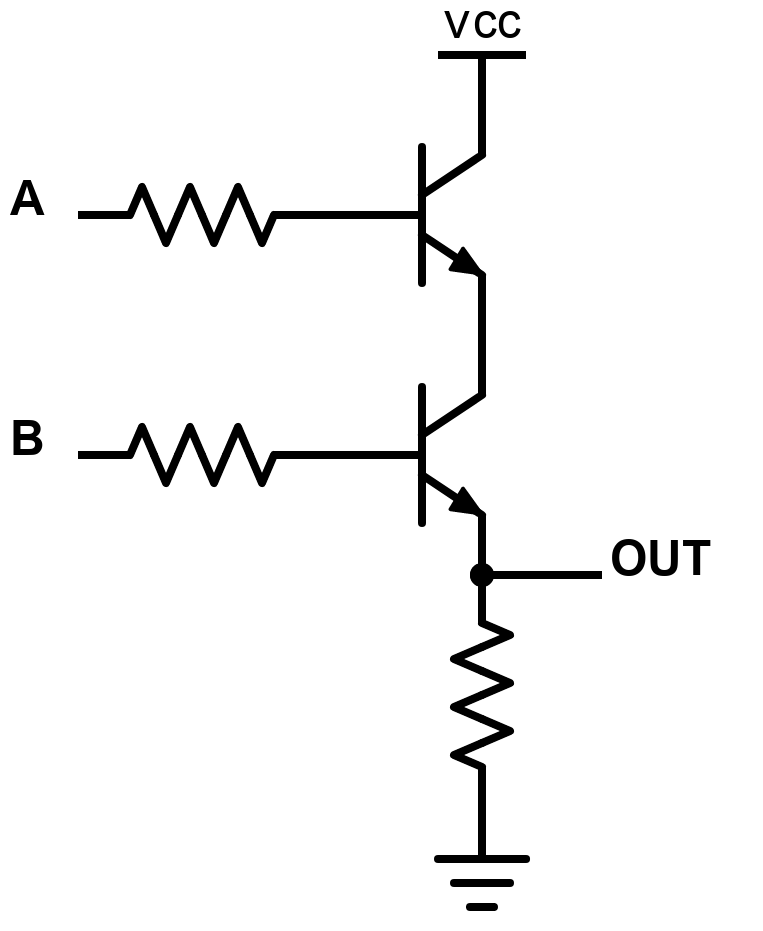
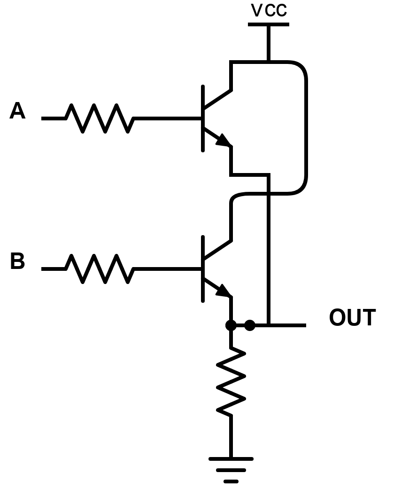
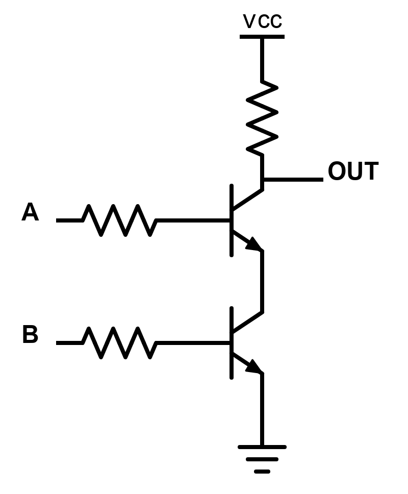
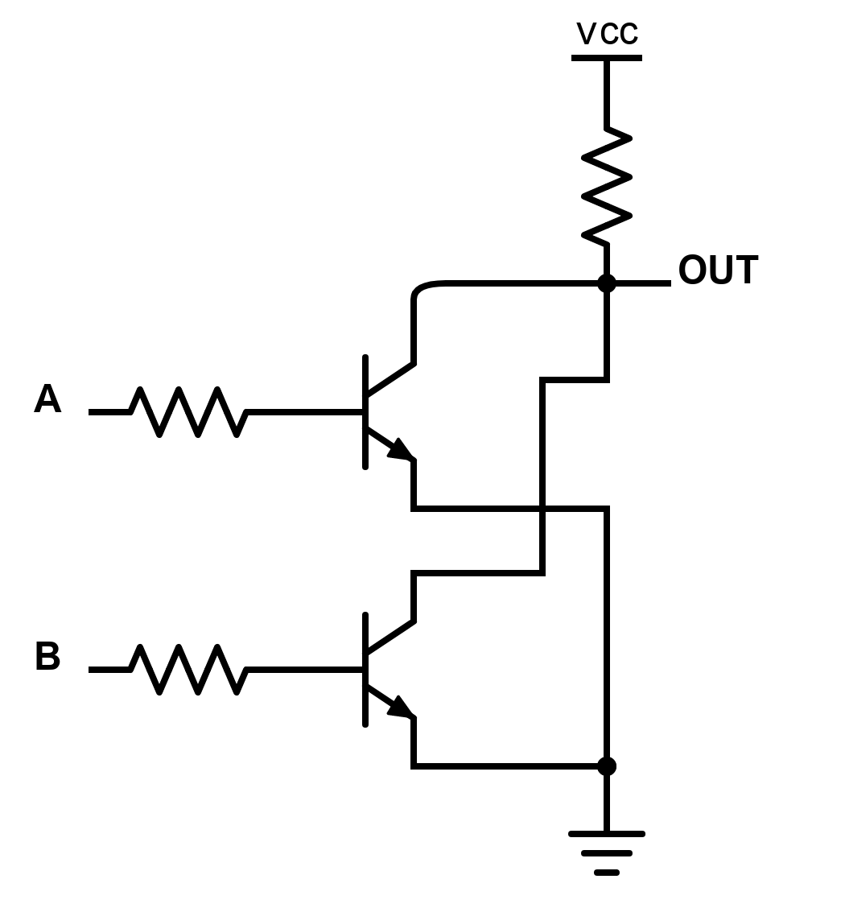
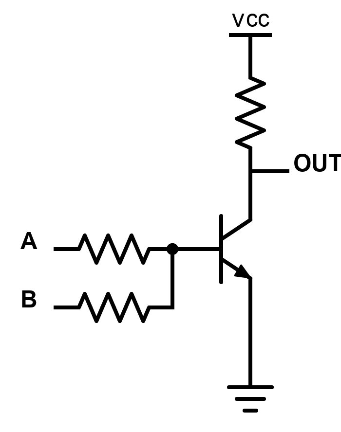

# Resistor-Transistor Logic (RTL)

!!! success "2020-2"
    Material atualizado.

| Estudando    |                     |
| ---------    | --                  |
| Bibliografia |                     |
|              | [Cap7. FLOYD, 2005] |
|              | [Cap8. TOCCI, 2011] |

**Leitura das páginas 1 - 13** (ler somente até buffer) do livro: RTL (Resistor-Transistor Logic) Cookbook by Don Lancaster. O livro está disponível em:

- https://archive.org/details/RTL_Resistor-Transistor_Logic_Cookbook/mode/2up

<iframe src="https://archive.org/embed/RTL_Resistor-Transistor_Logic_Cookbook" width="1120" height="768" frameborder="0" webkitallowfullscreen="true" mozallowfullscreen="true" allowfullscreen></iframe>

!!! tip
    Mais informações em: https://en.wikipedia.org/wiki/Resistor%E2%80%93transistor_logic

## Usando Transistores para recriar portas lógicas

O uso de transistores para criação de portas lógicas depende de seu uso como chave controlada eletronicamente. No transistor tipo BJT, quando o diodo na base-emissor está conduzindo, o transistor é levado a saturação e a tensão entre coletor e emissor se aproxima de zero. 

### Lógica E - AND

{width=200}

Para a lógica E (AND), ambos transistores estão em série e ambos devem estar conduzindo para que a saída (OUT) esteja em nível ALTO.

### Lógica OU - OR

{width=250}

Para a lógica OU (OR), ambos transistores estão em paralelo e enquanto pelo menos um deles estiver conduzindo, a saída (OUT) ficara em nível ALTO.

### Lógica NÃO E - NAND

{width=250}

Para a lógica NÃO E (NAND), ambos transistores estão em série e a saída está acima deles, a saída será nível ALTO a não ser que ambas entradas sejam colocadas em ALTO, no qual fará que os transistores conduzam e levem a saída para nível BAIXO.

### Lógica NÃO OU - NOR

{width=250}

Para a lógica NÃO OU (NOR), ambos transistores estão em série e a saída está acima deles, a saída será nível BAIXO desde que um deles esteja conduzindo.

{width=250}

Usando dois resistores no controle da base do transistor, é possível recriar a porta NOR com apenas um transistor.
